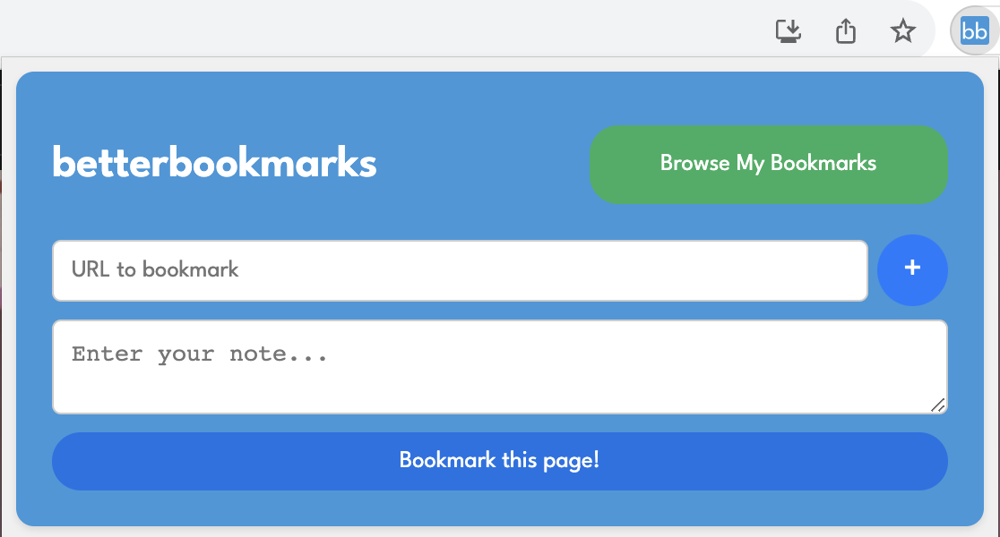

# betterbookmarks Chrome Extension

Better Bookmarks is a Chrome extension that allows users to bookmark webpages with notes. Instead of just saving a URL, this extension lets users add a note to explain why they saved a particular webpage.

## Features

- Bookmark webpages along with notes.
- Automatically fill in the current tab's URL.
- Browse and manage saved bookmarks.
- Delete saved entries.

## Development

The Better Bookmarks Chrome extension is developed using the following technologies:

- **Languages:** HTML, CSS, JavaScript
- **APIs and Libraries:** Chrome Extension API, Chrome Storage API

### Building and Testing

To build or test the extension locally, follow these steps:

1. Clone this repository or download the source code.
2. Open Google Chrome and go to `chrome://extensions/`.
3. Enable "Developer mode."
4. Click "Load unpacked" and select the extension's directory.
5. The extension icon should appear in your Chrome toolbar.

### Folder Structure

- `popup.html`: The main HTML file for the extension's popup.
- `popup.js`: The JavaScript code for the extension's popup.
- `popup.css`: The stylesheet for the extension's popup.

## Usage

- Click the extension icon in the Chrome toolbar to open the popup.
- In the "Bookmark a Webpage" section, enter the URL and add a note.
- Click the "+" button to fill in the current tab's URL.
- Click "Bookmark this page!" to save the entry.
- Click "Browse My Bookmarks" to view or delete saved bookmarks.

## License

This project is licensed under the MIT License - see the [LICENSE](LICENSE) file for details.
